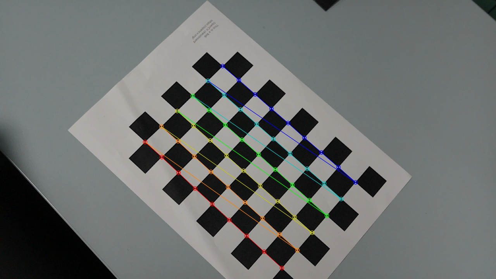
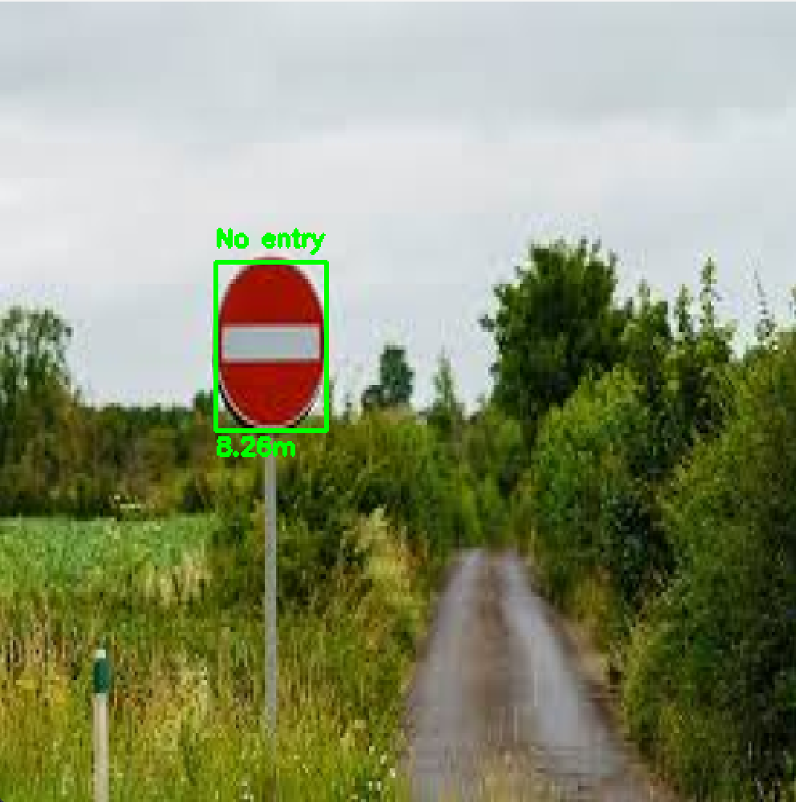
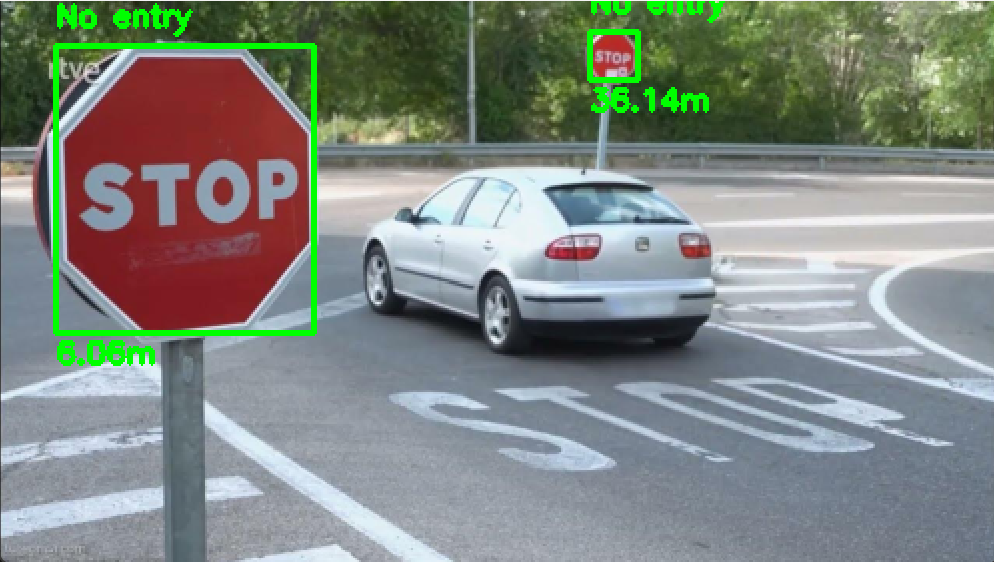
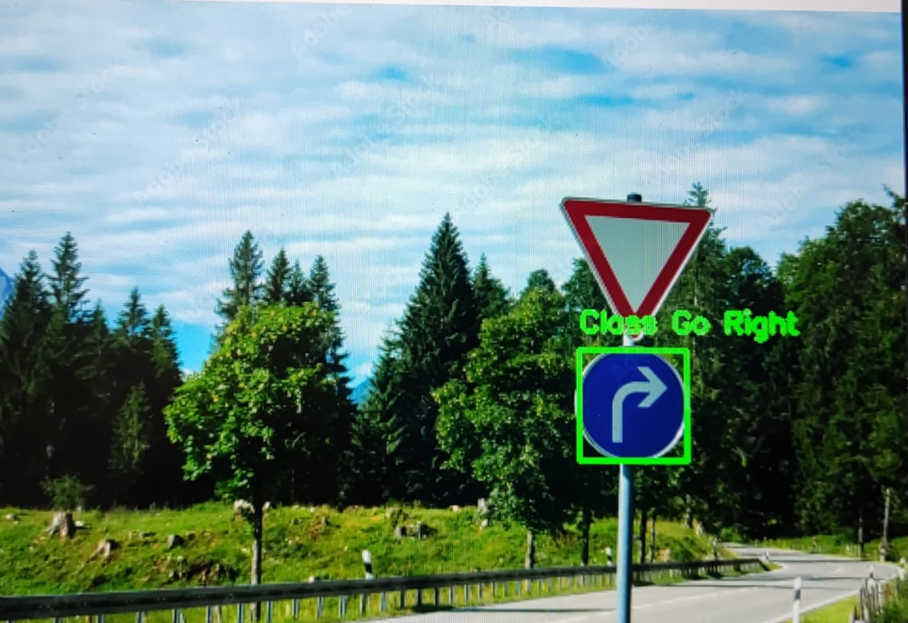
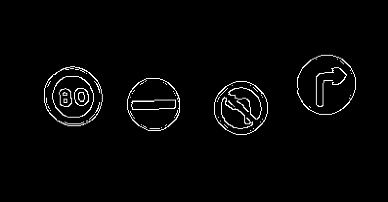
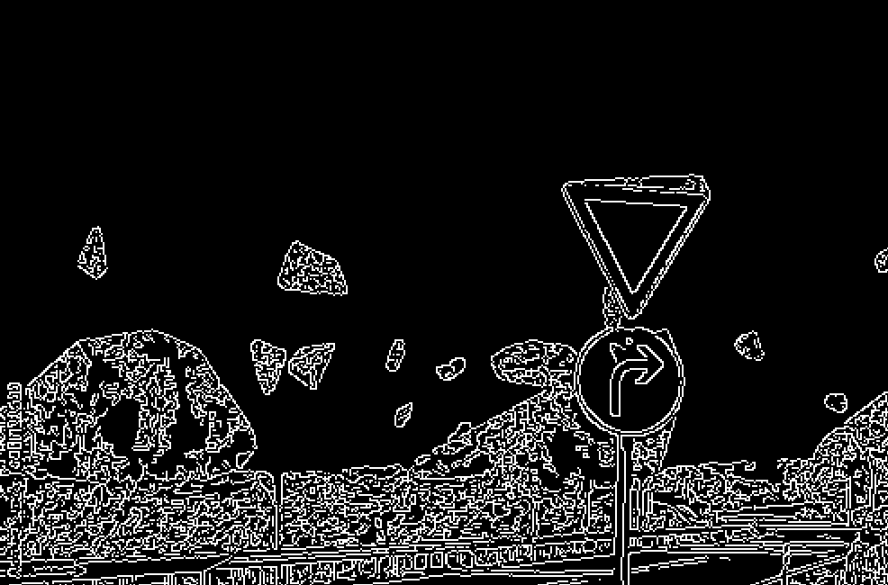
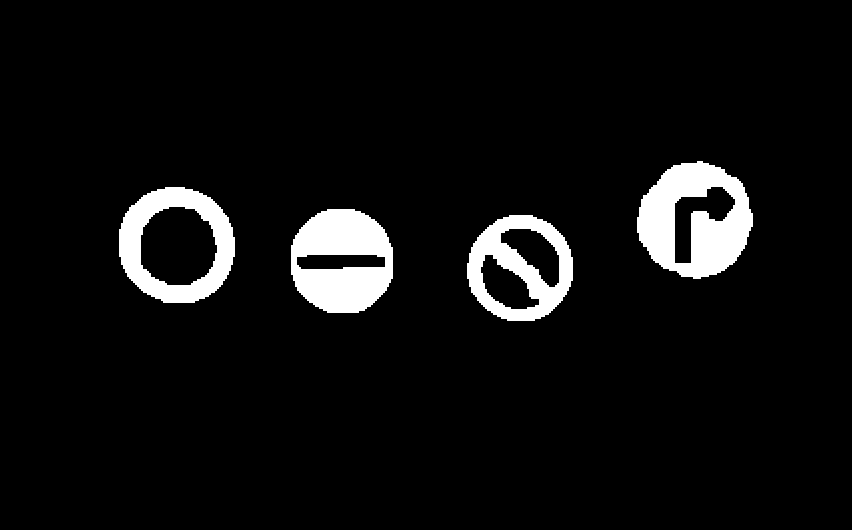
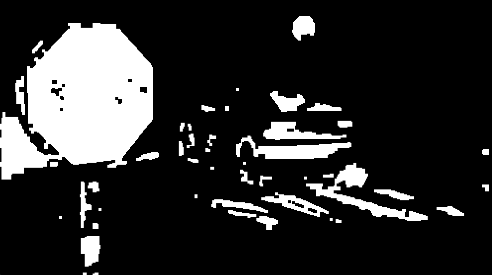
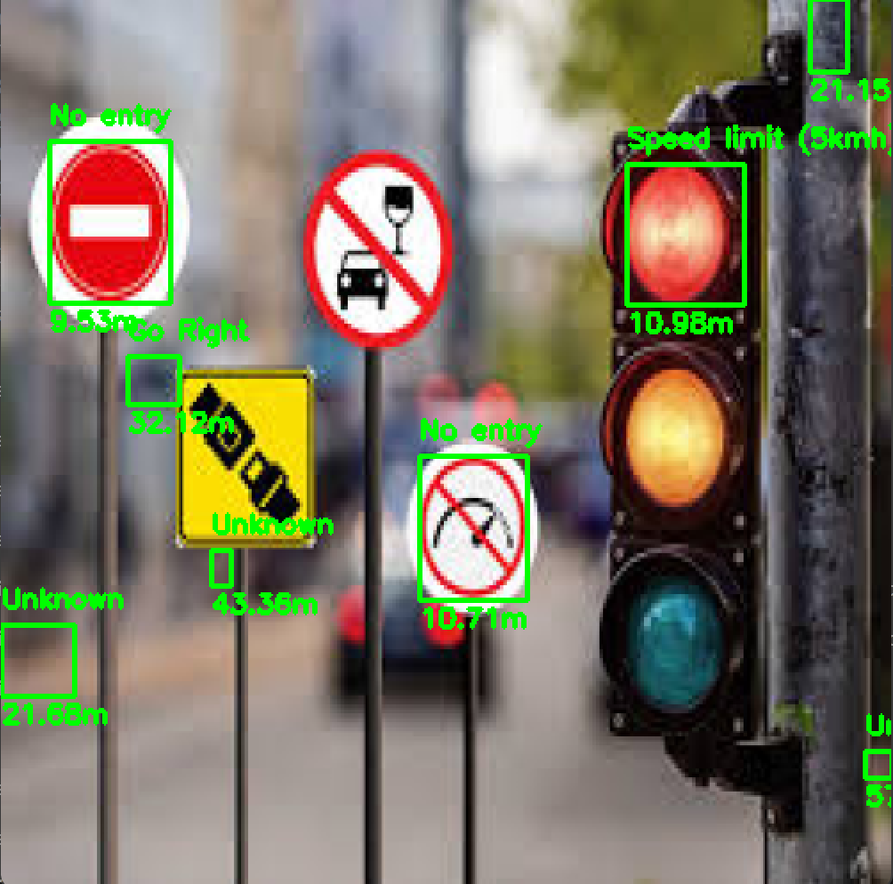

# Traffic Sign Detection and Tracking System

## Project Overview
A comprehensive computer vision system for real-time detection, tracking, and classification of traffic signs using OpenCV and machine learning techniques. The system processes video input to detect traffic signs, calculate their distance from the camera, and classify them according to their type.

## Key Features
- Traffic sign detection using classical computer vision techniques
- Real-time tracking using meanShift algorithm
- Distance estimation through camera calibration
- Sign classification using SVM with SIFT features
- Optimized performance with selective frame processing

## Example video


## System Requirements

- Python 3.8+
- OpenCV 4.8.0+
- NumPy
- scikit-image
- tqdm
- imageio

## Project Structure

```
.
├── src/
    ├── detect_signs.py
    ├── calibration/
    │   ├── camera_parameters.pkl
    │   ├── distortion_parameters.pkl
    │   ├── get_calibration_images.py
    │   └── calibration.ipynb
    ├── classifying/
    │   ├── utils/
    │   ├── classify.py
    │   └── train_classifier.py
    ├── tracking/
    │   ├── utils/
    │   └── tracking.py
    ├── video/
    │   └── utils.py
    ├── data/
    │   ├── traffic_Data/
    │   │   ├── DATA/
    │   │   └── TEST/
    │   └── calibration_images/
    └── README.md
```
## Installation
1. Clone the repository:
```bash
git clone https://github.com/merygon/Vision-por-Ordenador.git
cd Vision-por-Ordenador
```

2. Install dependencies:
```bash
pip install -r requirements.txt
```

## Usage Guide

To run the code, got into the src/ directory
```bash
cd src
```

### 1. Camera Calibration

Before using the system, you need to calibrate your camera:

```bash
jupyter notebook calibration/calibration.ipynb
```

The calibration process requires:
- A 9x6 chessboard pattern
- At least 10 images of the pattern from different angles
- Images should be stored in `calibration_images/`

The calibration script will generate `camera_parameters.pkl` containing intrinsic and extrinsic parameters.


*Example of a chessboard pattern with detected corners during calibration*


### 2. Training the Classifier

The classification model needs to be trained on a dataset of traffic signs:

```bash
python -m classifying.train_classifier
```

Requirements for training data:
- Minimum 100 images per sign class
- Images should be organized in folders by sign type
- Use the `data/traffic_Data/` directory structure


### 3. Running Detection
To run the main detection system:
```bash
python detect_signs.py
```

There are three modes of operation:

#### a. Image Detection
```python
from detect_signs import detect_signs_in_dir

detect_signs_in_dir("path/to/images/", fixed_width=500)
```

#### b. Video Processing
```python
from detect_signs import detect_signs_in_video

detect_signs_in_video("path/to/video.mp4", "output_video_name")
```

#### c. Real-time Detection
```python
from detect_signs import live_detection_video

live_detection_video(0)  # Use 0 for webcam or pass the path/to/video
```

## Example Images

### Detection Results


*Detection of no entry sign, distance is not correct because it is not using our camera*

### Tracking Visualization


*Detection of multiple signs in one frame, distance is not correct because it is not using our camera. The sign is classification is wrong because there are no stop signs in our dataset. However, the no entry sign is similar to this one.*

### Distance Estimation


*Classification of go right sign. It can be seen that the support for triangular shaped signs is not added yet*


## System Architecture

The system follows a modular pipeline:

1. **Image Preprocessing**
   - Median blur for noise reduction
   - Contrast enhancement when needed
   - MSER region detection

<div style="display: flex; justify-content: space-between;">
    <div style="flex: 1; margin-right: 10px;">
        
        <p><em>MSER result on an image. It can be seen that the signs are extracted</em></p>
    </div>
    <div style="flex: 1; margin-left: 10px;">
        
        <p><em>MSER result on an image. It can be seen that the sign is extracted but there are many more regions.</em></p>
    </div>
</div>

2. **Sign Detection**
   - Canny edge detection
   - Color-based masking and morphological operations
   - Circular detection using Hough Transform
   - Rectangular detection using Douglas-Peuker algorithm

<div style="display: flex; justify-content: space-between;">
    <div style="flex: 1; margin-right: 10px;">
        
        <p><em>Canny edge detection result on an image. It can be seen that the signs are extracted</em></p>
    </div>
    <div style="flex: 1; margin-left: 10px;">
        
        <p><em>Canny edge detection result on an image. Many edges are found in the image after the mser is applied.</em></p>
    </div>
</div>

<div style="display: flex; justify-content: space-between;">
    <div style="flex: 1; margin-right: 10px;">
        
        <p><em>Color segmentation mask of an image. It can be seen that the signs are extracted</em></p>
    </div>
    <div style="flex: 1; margin-left: 10px;">
        
        <p><em>Color segmentation mask of an image. Many blobs are left because they are a similar color.</em></p>
    </div>
</div>



*Image with false detections*

3. **Tracking**
   - Mean shift algorithm for efficient tracking
   - Detection refresh every 100 frames
   - HSV histogram-based tracking

4. **Classification**
   - SIFT feature extraction
   - Bag of Words representation
   - SVM classifier

5. **Distance Calculation**
   - Uses intrinsic camera parameters
   - Real-world sign height estimation (0.5m standard)
   - Focal length-based distance computation

## Performance Optimization

The system includes several optimizations for real-time performance:

- Mean shift tracking to reduce computational load
- Selective frame processing (every 100 frames for full detection)
- Efficient region of interest selection using MSER
- Optimized color space conversions

## Limitations and Future Work

Current limitations:
- Requires good lighting conditions
- Minimum size requirements for sign detection
- Processing speed depends on hardware capabilities
- Classifier only gets 60% accuracy on test set while it gets over 95% accuracy on training set. A better dataset should be used and maybe a different model to get better performance.

Potential improvements:
- Parallel processing for shape detection
- Add support for detecting triangular shaped signs

## Acknowledgments

This project was developed by María González Gómez and Jorge Vančo Sampedro as part of their Computer Vision course project. Special thanks to the course instructors and contributors.
